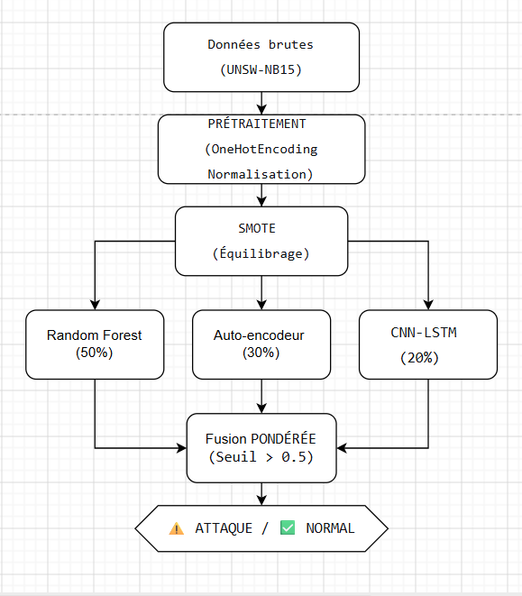
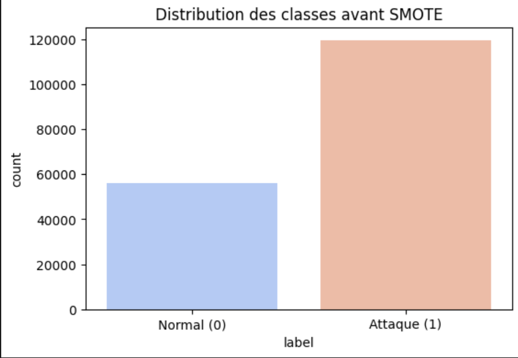
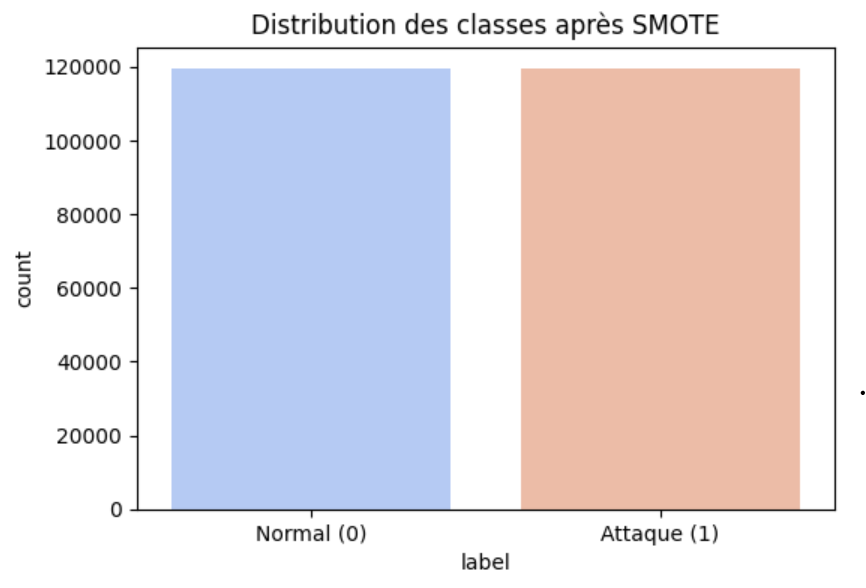
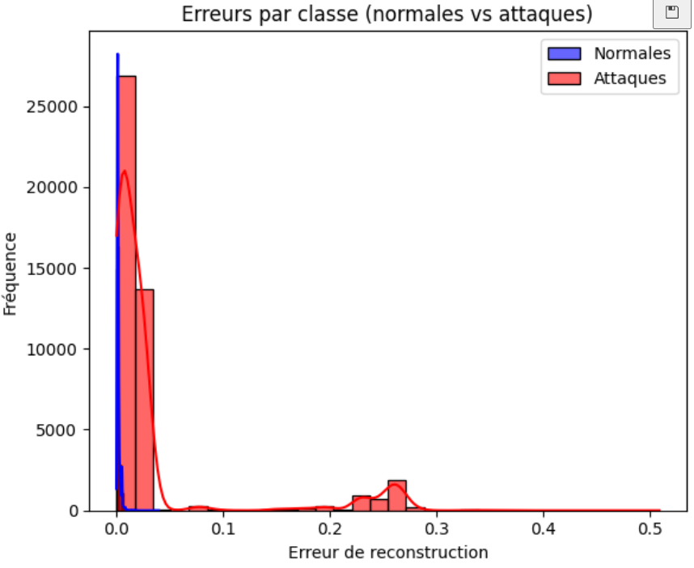
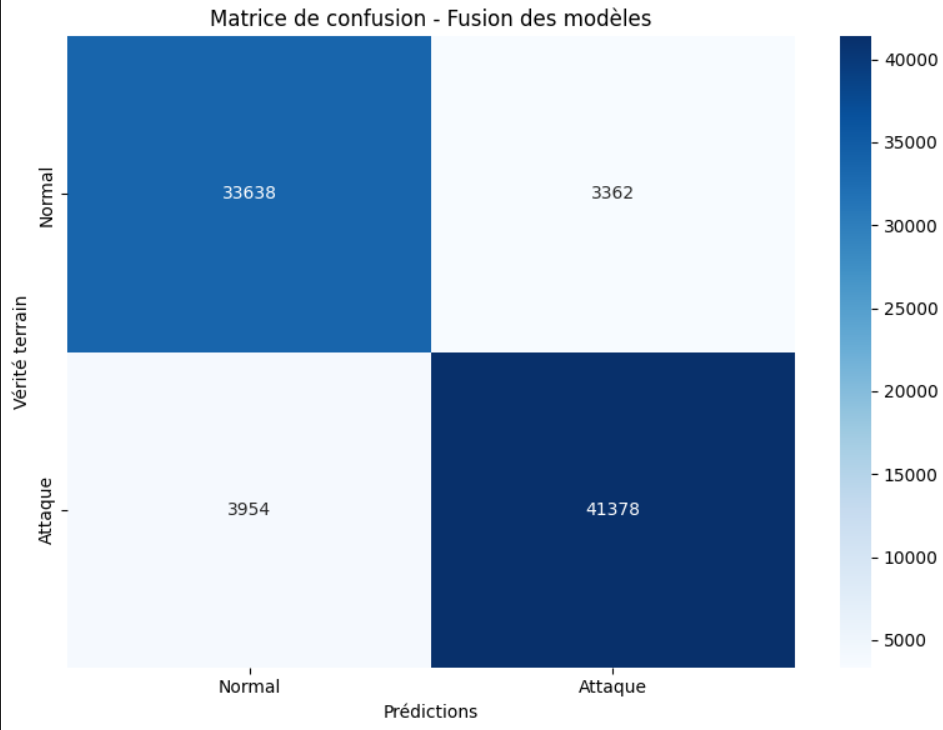

# 🔐 IDS-ML: Détection d'Intrusions Réseau par Ensemble Learning

## 📌 Description

Système de détection d'intrusions (IDS) basé sur la fusion de 3 modèles de machine learning pour classifier le trafic réseau (normal vs attaque).

## 🎯 Objectif

Détecter automatiquement les attaques réseau avec une haute précision en combinant les forces de différents algorithmes.

## 📊 Dataset

**UNSW-NB15** - Benchmark de référence en cybersécurité

- 93 000 échantillons
- 45 features
- 9 types d'attaques (DoS, Fuzzing, Reconnaissance, etc.)

## 🏗️ Architecture



| Modèle           | Poids | Rôle                   |
| ---------------- | ----- | ---------------------- |
| 🌳 Random Forest | 50%   | Classification robuste |
| 🔄 Autoencodeur  | 30%   | Détection d'anomalies  |
| 🧠 CNN-LSTM      | 20%   | Analyse temporelle     |

## 📈 Résultats

| Métrique             | Score      |
| -------------------- | ---------- |
| **Accuracy**         | **91.11%** |
| Precision (Attaques) | 92%        |
| Recall (Attaques)    | 91%        |
| F1-Score (macro)     | 0.91       |

## 📊 Visualisations

### Équilibrage des classes

| Avant SMOTE                                     | Après SMOTE                                    |
| ----------------------------------------------- | ---------------------------------------------- |
|  |  |

### Autoencodeur - Détection d'anomalies



_Les attaques (rouge) ont une erreur de reconstruction plus élevée que les normales (bleu)_

### Matrice de confusion - Modèle fusionné



## 🛠️ Technologies utilisées

- **Python** - Langage principal
- **Pandas/NumPy** - Manipulation des données
- **Scikit-learn** - Random Forest, prétraitement, métriques
- **TensorFlow/Keras** - Autoencodeur, CNN-LSTM
- **SMOTE** - Équilibrage des classes
- **Matplotlib/Seaborn** - Visualisations

## 📁 Structure du projet

IDS-Network-Intrusion-Detection/

│

├── README.md # Ce fichier

├── requirements.txt # Dépendances

├── notebook.ipynb # Notebook principal

│

├── data/ # Dataset

│ ├── UNSW_NB15_training-set.csv

│ └── UNSW_NB15_testing-set.csv

│

├── results/ # Résultats et visualisations

└── docs/ # Documentation

## 🚀 Installation et exécution

```bash
# 1. Cloner le repository
git clone https://github.com/OumaimaELBAHLOULI/IDS-ML.git
cd IDS-ML

# 2. Installer les dépendances
pip install -r requirements.txt

# 3. Télécharger le dataset
# Télécharger UNSW-NB15 depuis le site officiel
# puis placer les fichiers dans le dossier data/

# 4. Lancer le notebook
jupyter notebook notebook.ipynb
```
## 👤 Auteur

**Oumaima ELBAHLOULI**

[LinkedIn](https://linkedin.com/in/oumaima-elbahlouli) | [GitHub](https://github.com/OumaimaELBAHLOULI)

[LinkedIn](https://linkedin.com/in/oumaima-elbahlouli) | [GitHub](https://github.com/OumaimaELBAHLOULI)
```
